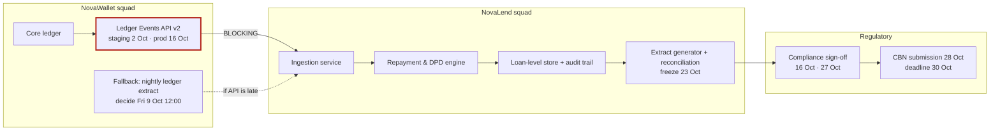

# NovaLend Scrum Master Ops Kit

**FirstBank Digital Factory · Scrum Master take-home task**
Prepared by Deborah Agbanimu, incoming Scrum Master, NovaLend squad

This kit is a working plan to get the NovaLend squad to the CBN regulatory reporting deadline on **Friday 30 October 2026**. It is built for one specific situation, not general Scrum practice:

- **Team:** 7 people — 4 engineers, 1 QA, 1 designer and 1 PO.
- **Time zones:** one remote contractor who is 5 hours behind Lagos.
- **History:** two missed sprints in a row, and low morale.
- **Deadline:** 6 weeks away, and it cannot move.
- **Dependency:** a blocking API from the NovaWallet squad, which has slipped before.

## What's in this repository

| File | What it is |
|---|---|
| `NovaLend_Scrum_Master_Ops_Kit.pptx` | The full Ops Kit: all six artifacts and three stretch goals (22 slides) |
| `README.md` | This page |
| `AI_USAGE.md` | Which AI tools were used, the prompts, and where AI output was wrong and how it was fixed |

## Where to find each artifact

| # | Artifact | Slides | Assessment criterion it answers |
|---|---|---|---|
| 1 | **6-week plan** — timeline, capacity (holiday + leave), protect/defer/cut trade-offs, burn-up, ceremony cadence | 4–8 | Situational specificity |
| 2 | **RAID log** — 13 entries, each with owner, severity, mitigation and date | 9–10 | Risk & dependency management |
| 3 | **Retro facilitation plan** — agenda, exact questions, handling dominant and quiet voices, output → owned actions | 11–13 | Facilitation quality |
| 4 | **Stakeholder comms plan** — weekly, monthly and one-off audiences, plus a fully written sample status update | 14–15 | Stakeholder communication |
| 5 | **Ceremony redesign** — standup, planning and retro rebuilt for the contractor, plus one concrete day hour by hour | 16–17 | Situational specificity |
| 6 | **Dependency map** — NovaWallet API dependency, fallback path, RAG rules and escalation ladder | 18–19 | Risk & dependency management |

**Stretch goals**
- **Burn-up and capacity charts:** slides 5 and 7.
- **Escalation script with the exact words:** slide 19.
- **Regulator-facing Definition of Done:** slide 20.

**Defending the plan:** slide 21 lists the six pushbacks I expect from leadership, with my answers.

## Key numbers at a glance

| | |
|---|---|
| Plan window | Mon 21 Sep – Fri 30 Oct 2026 (29 working days; Independence Day, Thu 1 Oct, excluded) |
| Sprint shape | Sprint 1 (2 weeks) · Sprint 2 (2 weeks) · Sprint 3 (1 week, feature freeze Fri 23 Oct) · Hardening week |
| Capacity basis | Delivered velocity of the last two sprints (21 and 19 pts) ≈ 0.5 pts per engineer-day |
| Capacity | 111 engineer-days after holiday and approved leave (12–16 Oct) → 45.5 pts forecast |
| Commitment | 38 pts (84% of forecast). 18 pts deferred to November, 5 pts cut or simplified |
| Key dates | API contract 25 Sep · NovaWallet API in staging 2 Oct · fallback go/no-go 9 Oct 12:00 · API in production 16 Oct · freeze 23 Oct · Compliance sign-off 27 Oct · **submission 28 Oct** · deadline 30 Oct |
| Contractor overlap | 14:00–17:00 WAT (09:00–12:00 Toronto). Every live ceremony sits inside this window |

## Dependency map (Mermaid)

The same map appears as a diagram on slide 18.

**Escalation ladder** (full detail on slide 19)

| Level | Who | When |
|---|---|---|
| L0 | Tech lead ↔ NovaWallet tech lead | Same day |
| L1 | Scrum Master ↔ NovaWallet EM | Within 2 working days |
| L2 | Head of Engineering | By Fri 9 Oct, 12:00 |
| L3 | Head of Digital Factory, with Compliance informed | Within 48h if L2 is unresolved |

## Assumptions to note

Some details are illustrative and were created for this exercise:

- team member names
- the NovaWallet EM's name
- last-sprint point figures
- the InfoSec ticket number
- the exact CBN report scope

The report scope is recorded as assumption **A1** in the RAID log. On Day 1 I would confirm it in writing with Compliance, and check the sprint figures in Jira before planning.

## How to view

- **PowerPoint:** open the `.pptx` in PowerPoint, Keynote or Google Slides. Speaker notes on slides 1, 4, 18 and 22 hold extra talking points.
- **Mermaid:** the diagram above renders automatically on GitHub and GitLab.